# Comparação — jogo contra as sete imagens aprovadas

Evidência da revisão cinematográfica ([spec #24](https://github.com/renatobardi/dungeons-and-dragons-final-episode/issues/24)).

**Condições de execução.** 13/09/2026, MacBook do produtor, Chrome 153.0.8010.36, backend **WebGPU**,
janela 1512×945 com DPR 2, resolução real de renderização **3024×1890**, build de produção servida por
`vite preview`. Capturas e vídeo saem de `pnpm measure`, sempre pela câmera de primeira pessoa de Bobby —
não há câmera de apresentação em nenhum quadro.

Alvos: [galeria aprovada](art-direction/cinematic-v1/index.html). Imagens do jogo:
[docs/comparison-cinematic](comparison-cinematic). Vídeo do percurso completo:
[percurso.webm](comparison-cinematic/percurso.webm).

Isto é evidência para julgamento, **não é aceite**. As imagens conceituais aprovam o alvo de qualidade;
a aprovação da implementação é do produtor, com o jogo em movimento.

## Os sete pares

### 1. Sala e abóbada — alvo `01-chapel-hall.png`

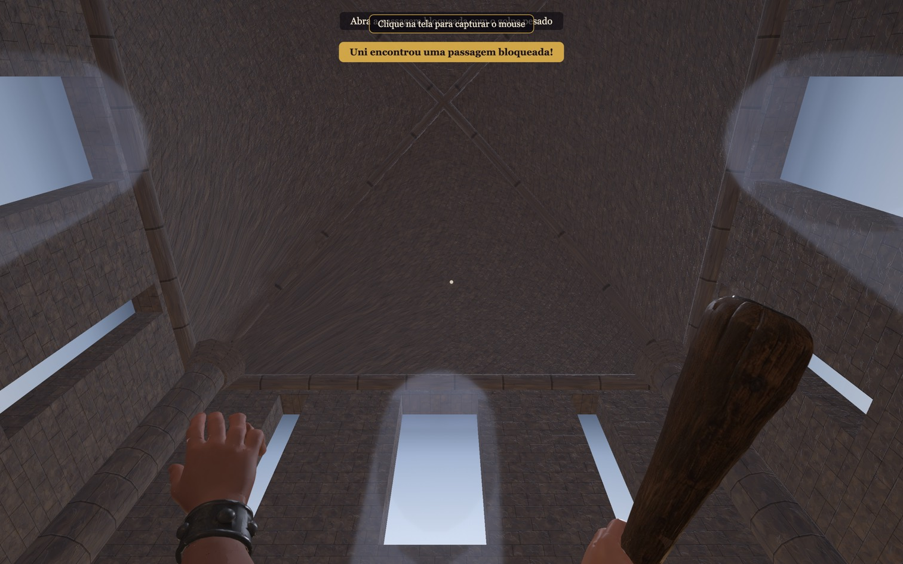
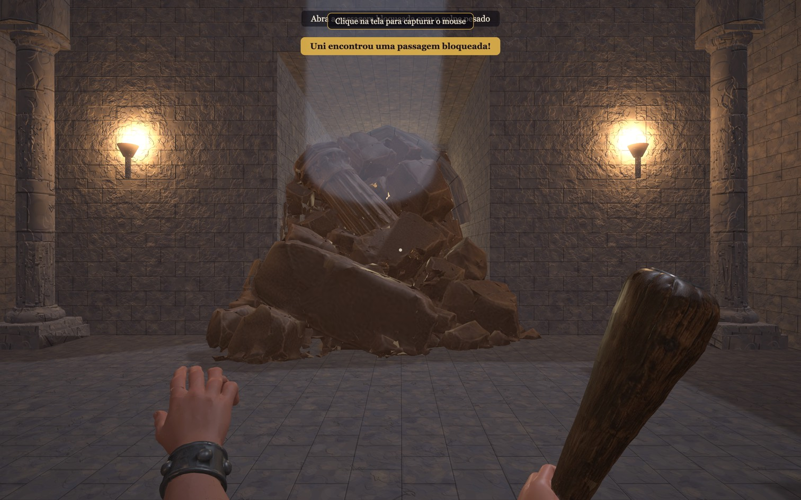

A sala deixou de ter tampa a 4 m. A abóbada é de nervuras quadripartida, com o fecho a **17 m** do piso
(arranque a 9 m, flecha de 8 m) — altura escolhida na composição e conferida pela câmera baixa de Bobby,
não um número aprovado de antemão. Nervuras diagonais, arcos transversais contra as quatro paredes,
pilares com capitel e claristório de doze janelas com luz fria.

**Diferenças que ficam.** O alvo tem várias travées em enfiada e uma nave de profundidade que este
percurso não tem: a sala é um vão único de 10×10 m, e aumentar altura não autoriza acrescentar salas. As
estátuas monumentais nos pilares do alvo não existem aqui. O feixe de luz ainda é geometria aditiva, não
volumetria real, e por isso lê melhor de longe do que de perto.

### 2. Bobby, braços e tacape — alvo `02-bobby-arms-club.png`

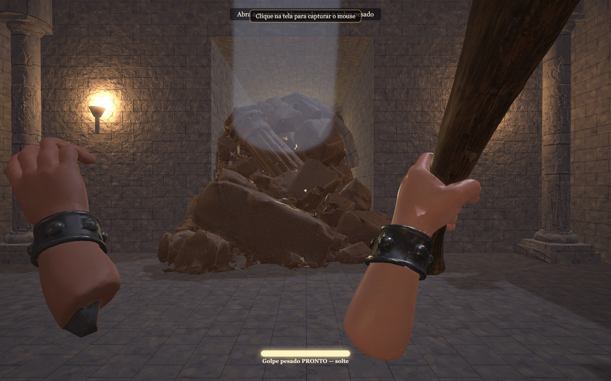
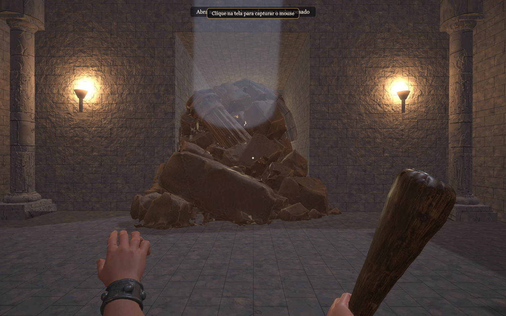

Antebraços contínuos até mãos infantis, braceletes de metal com rebites, tacape de peça única de madeira
afunilado até o punho, com fibra e desgaste. Braço e tacape são **uma malha só**, gerada a partir de
recorte da imagem aprovada: os dedos fecham numa empunhadura modelada com eles, então não há junta para
desalinhar nem interpenetração para ajustar.

O golpe tem três tempos — preparação, impacto, recuperação — e o pesado é mais lento e mais fundo, não
apenas maior. A curva está em [`src/render/strike-pose.ts`](../src/render/strike-pose.ts) e é testada:
oito testes cobrem o recuo antes da descida, o impacto no meio do curso, o retorno ao repouso e a
continuidade quadro a quadro.

**Diferenças que ficam.** O alvo mostra pele com poros e subsuperfície; aqui a pele é PBR com mapas 2K
reduzidos a 1K, sem SSS. Os dedos não animam — a mão é rígida e o movimento é do braço inteiro.

### 3. Uni — alvo `03-uni-character.png`

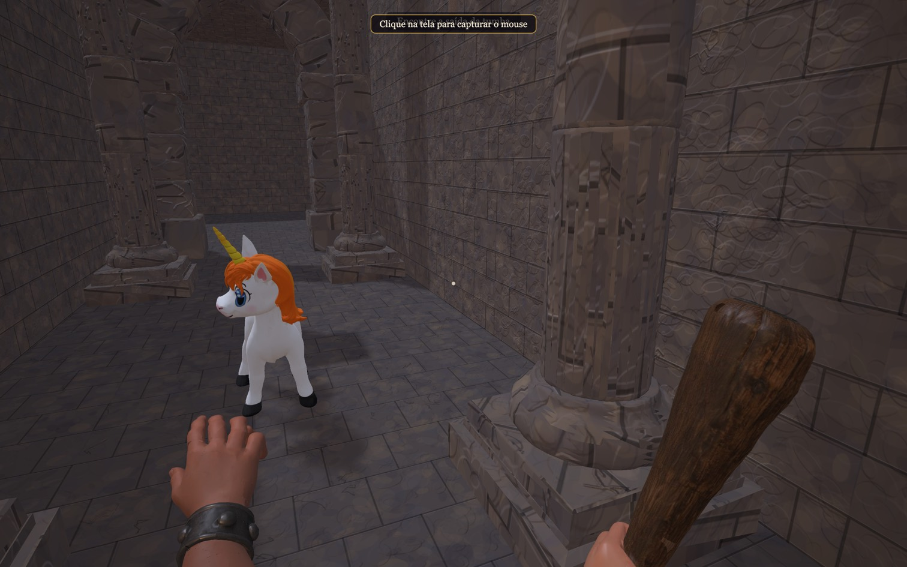
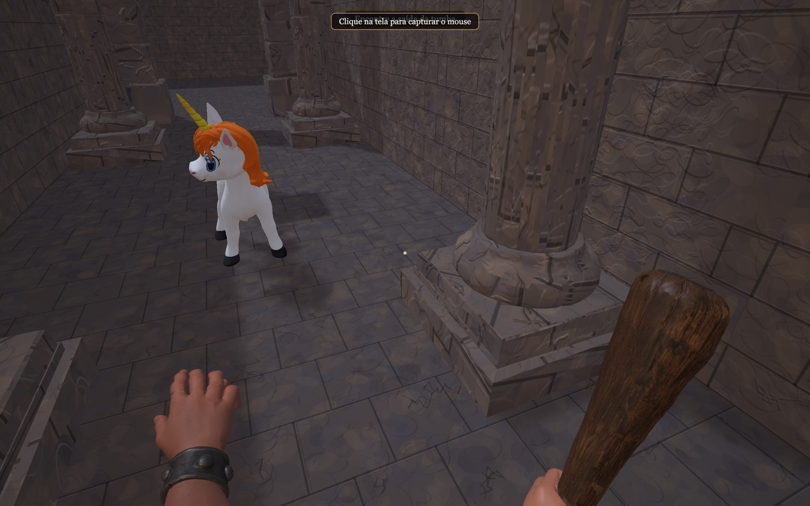

**Este par reprova.** A Uni em jogo continua a malha do ticket 13: identidade correta — filhote de corpo
claro, crina laranja, chifre — e o esqueleto quadrúpede com os clipes de repouso, caminhada e alerta
funcionando, com a passada dirigida pela distância percorrida e sem deslizamento. O acabamento não está
no alvo: crina de aresta dura, corpo branco chapado e material que responde à luz como plástico moldado.

Duas gerações novas foram tentadas e descartadas, 60 créditos, porque vieram com proporção de cavalo
adulto — que o [ticket #26](https://github.com/renatobardi/dungeons-and-dragons-final-episode/issues/26)
proíbe por escrito — e a segunda ainda trouxe furos na malha. O registro e as duas rotas que continuam
abertas estão em [MESHY-LEDGER.md](MESHY-LEDGER.md). **A Uni é a pendência desta rodada.**

### 4. Pórtico e corredor — alvo `04-portico-corridor.png`

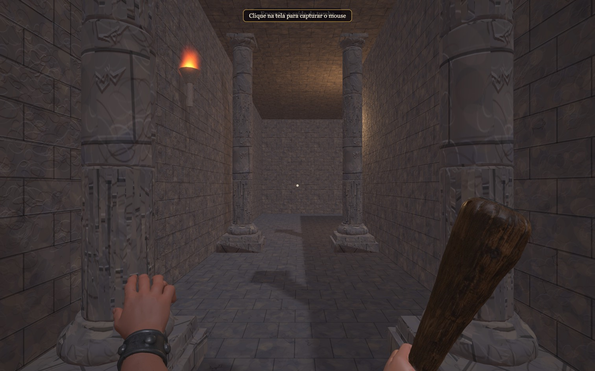

Pedra com relevo, rugosidade e erosão reais, e a curva do percurso continua legível. As colunas perderam
a ardósia azul chapada e vestem a mesma pedra da sala.

**Diferenças que ficam.** O corredor mantém o teto a 4 m, que é o volume que a simulação colide; o alvo
mostra um corredor abobadado e muito mais alto. Subir o corredor é escopo de outra rodada.

### 5. Pedra, colunas e estátuas — alvo `05-stone-columns-statues.png`

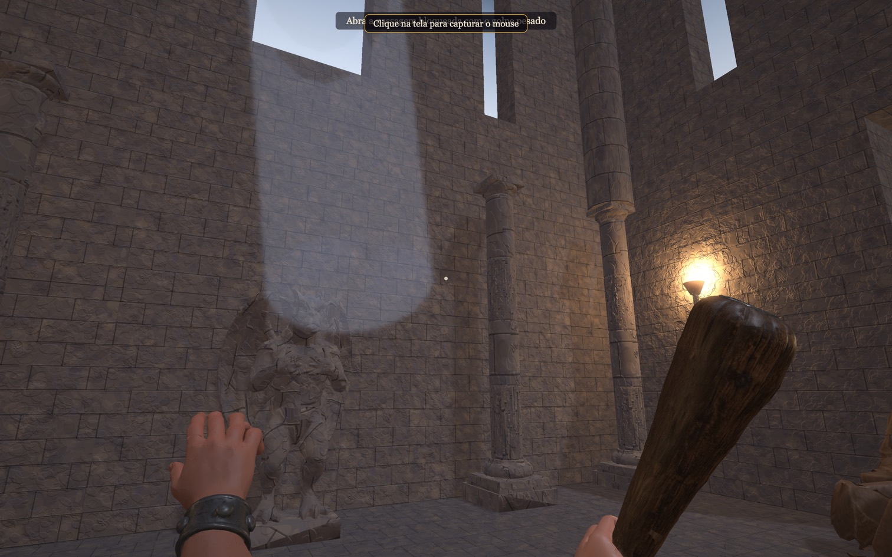

Paredes, piso, teto, abóbada, colunas, estátuas e arco usam a **mesma pedra**, com cor, relevo e
rugosidade derivados do mesmo passe procedural. A densidade de textura é medida em metros — cada
superfície carrega UVs em metros, não por face — então um pilar de 1 m e uma parede de 10 m mostram
fiadas do mesmo tamanho. Era esse o defeito que fazia a sala parecer colagem.

**Diferenças que ficam.** Os relevos figurativos do alvo (frisos, capitéis esculpidos, brasões) não
existem: as colunas são tambores lisos com base e capitel, e a gárgula é a peça do ticket 07.

### 6. Passagem bloqueada — alvo `06-blocked-passage.png`

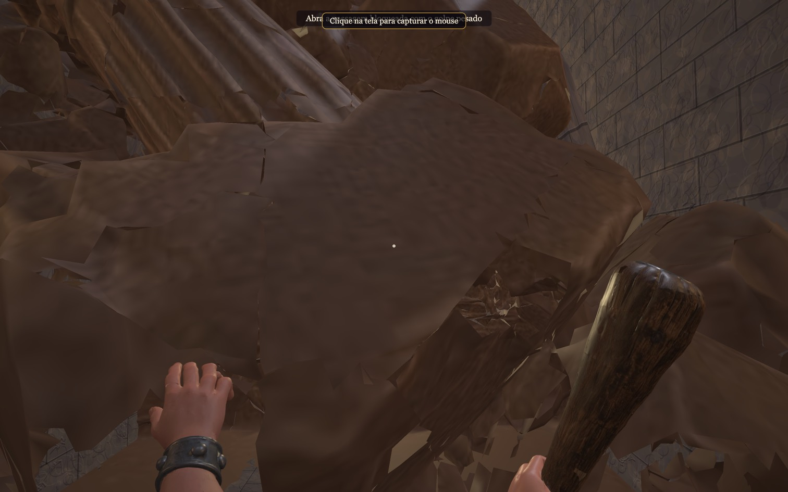

Monte de blocos partidos com tambor de coluna caído, colocado inteiro e com escala uniforme — o bloqueio
anterior era um relevo raso esticado até a porta, que borrava os blocos em prismas. A face trabalhada
encara Bobby e o eixo mais largo atravessa o vão.

**Diferenças que ficam.** O alvo tem escombros espalhados pelo piso ao redor e uma moldura de arco
esculpido em volta do vão; aqui o entulho está contido no vão e a moldura é a própria parede.

### 7. Passagem liberada e saída — alvo `07-open-passage-exit.png`

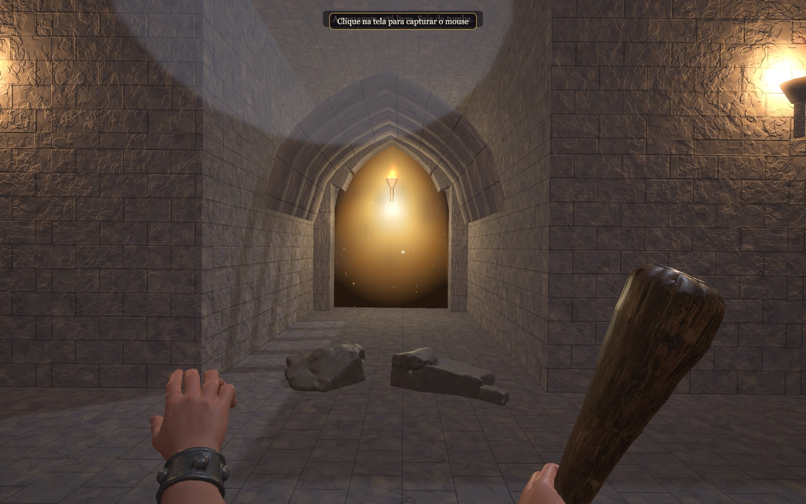
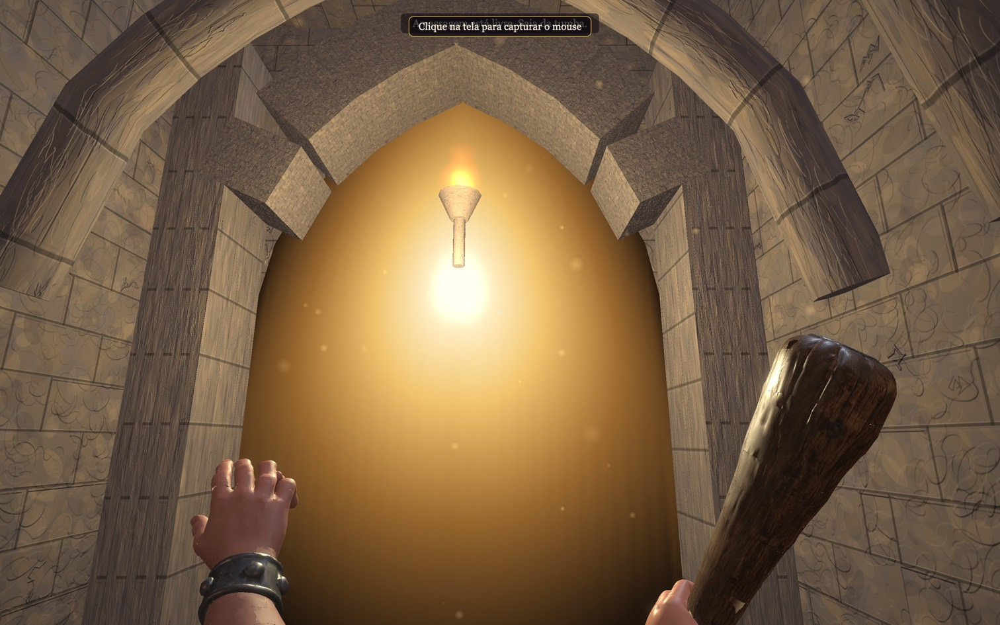

O retângulo branco estourado saiu. A saída é um arco ogival recortado num vão de pedra com aduelas, luz
que cai dentro da abertura em vez de saturar, poeira suspensa e quatro arcos transversais recuando pelo
antecâmara para dar a medida da distância. Depois da quebra, os escombros ficam nas duas ombreiras e o
centro fica livre e visivelmente transitável.

**Diferenças que ficam.** O alvo mostra uma nave abobadada inteira além da porta, com outra porta ao
fundo; aqui o que há além do arco é luz, não geometria. A antecâmara mantém o teto a 4 m.

## Desempenho, com toda a arte e os efeitos presentes

Percurso de 10 s com a câmera girando, duas resoluções, 1200 quadros cada.

| DPR | Resolução real | Média | p95 | Pior quadro | Quadros > 33 ms |
| --- | --- | --- | --- | --- | --- |
| 2 | 3024×1890 | 8,3 ms | 10,0 ms | 12,1 ms | 0 |
| 1,5 | 2268×1417 | 8,3 ms | 9,9 ms | 13,0 ms | 0 |

Carregamento a frio no perfil "Fast 4G" do DevTools (4 Mbps, 20 ms): **7,3 MB transferidos, 15,4 s até a
tela inicial**. Antes da revisão eram 4,9 MB e 10,2 s. O crescimento é a arte nova: dois braços, dois
montes de escombros e as texturas PBR que vêm com eles.

**Limitações desta medição, que precisam ser ditas.** A média de 8,3 ms é exatamente o intervalo de um
display de 120 Hz: o número está preso ao vsync, então ele prova que o jogo acompanha 120 Hz, mas **não
mede quanta folga existe** — não dá para distinguir "sobra muito" de "na conta". O que sustenta a
conclusão é o pior quadro, 12,1 ms, bem abaixo dos 16,7 ms de 60 fps, e a ausência total de quadros acima
de 33 ms. O alvo de 60 fps está atendido com folga e **não houve necessidade de recorrer aos 30 fps
estáveis**. A medição é de um percurso com animações, partículas e a quebra; não é sala vazia. Memória
não foi observada — o `SystemInfo` do Chrome não devolveu dados de GPU nesta execução.

## Regras, controles e confiabilidade

Nada da simulação mudou. Os muros que Bobby colide continuam a 4 m; toda a arquitetura acima deles é
desenho, sem colisor. Movimento, mouse/teclado, alcance, carga, regra de quebra, alerta da Uni, pausa,
reinício e conclusão seguem cobertos pela suíte existente.

Verde no commit desta evidência: lint, types, **96 testes unitários** (três módulos novos escritos em
TDD — abóbada, mapa de normais e UVs em metros — mais oito testes da curva do golpe) e **11 cenários de
navegador**, dois deles novos e escritos para a spec:

- um modelo obrigatório que falha leva à tela de erro, não à tela inicial, e sem rejeição não tratada;
- rede lenta não libera "pronto" antes do equipamento estar em cena. Este falhou pelo motivo certo
  quando o equipamento foi retirado da promessa de prontidão, e passou quando foi recolocado.

## O que falta para o aceite

1. **Uni.** É a única peça abaixo do alvo. O produtor decide a rota: retextura da malha atual (10
   créditos) ou correção de proporção no Blender sobre a geração descartada (sem consumo).
2. **Aprovação do produtor** do conjunto em movimento, com o vídeo, ou a lista de ajustes objetivos.

Sobram **320 dos 500 créditos** autorizados. A revisão não está concluída, e não está sendo declarada
concluída por esgotamento de orçamento — o orçamento não esgotou.
