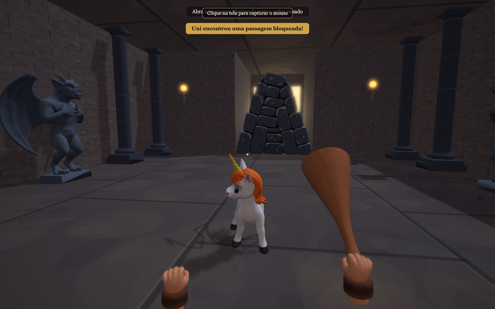
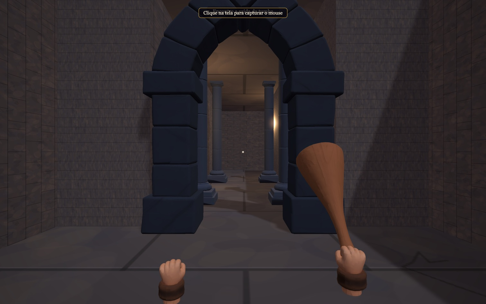
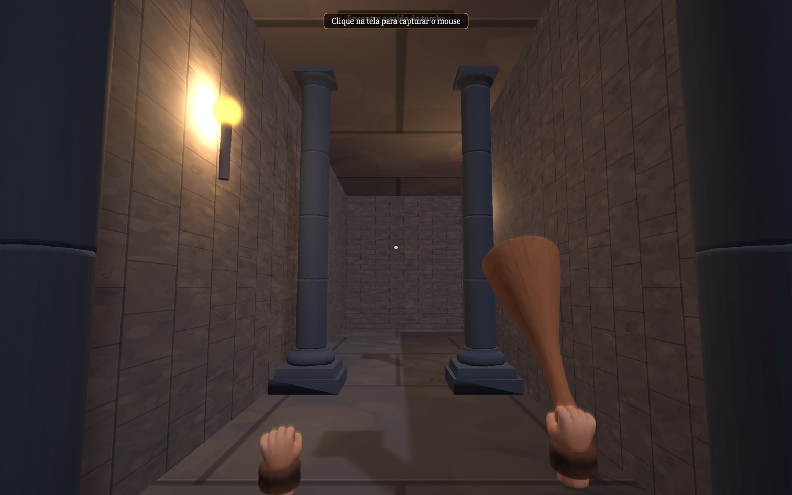
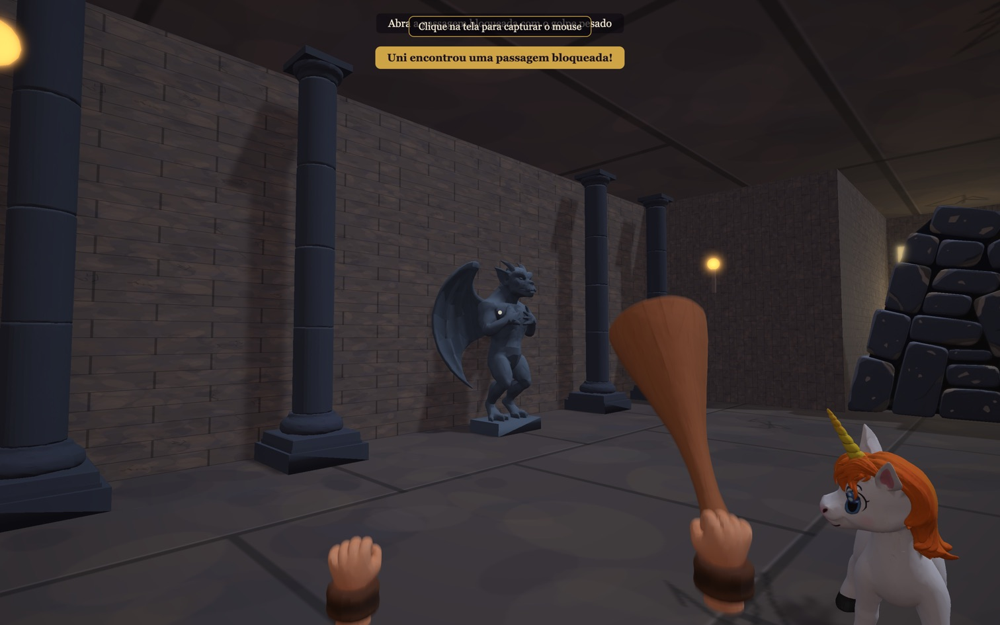
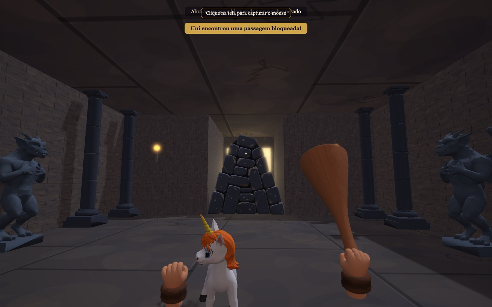
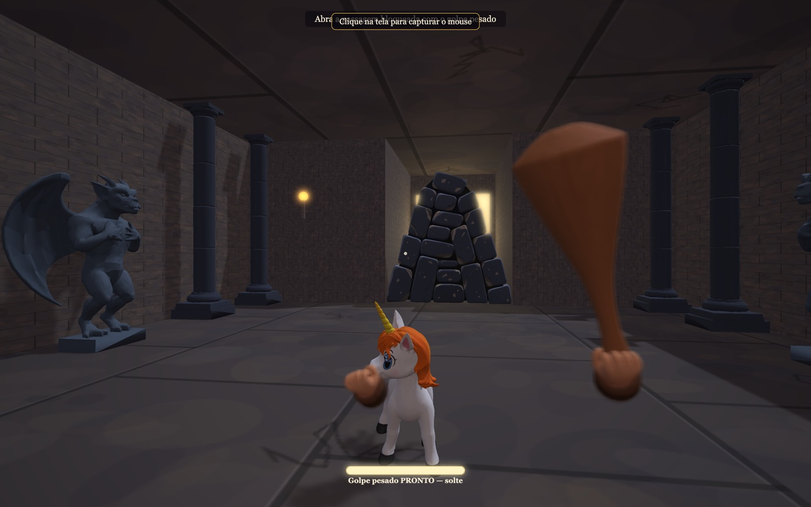

# Comparação visual — arte final contra o desenho

Evidência do ticket 11 ([issue #15](https://github.com/renatobardi/dungeons-and-dragons-final-episode/issues/15)). Capturas feitas em 12/09/2026 no Chrome 153 do MacBook M5, WebGPU, 3024×1890, a partir do build de produção.

Os quadros do desenho **não são reproduzidos aqui**: são material de terceiros, usados só como referência interna, e ficam fora do git (`docs/references/`, ver [REFERENCES.md](REFERENCES.md)). Cada comparação aponta o episódio e o minuto, para quem quiser abrir o quadro ao lado.

## Pares

### Uni

Referência: `uni-fullbody-walk-side-s01e01-t0250s.jpg` — S01E01, 04:10.

Pelagem branca, crina e cauda laranja, chifre dourado, escala de filhote contra a altura dos olhos de Bobby (1,2 m).

Esta captura é **anterior ao rig**: quando ela foi tirada, a Uni era malha única e as patas não se mexiam. O [ticket 13](https://github.com/renatobardi/dungeons-and-dragons-final-episode/issues/17) fechou isso em 12/09/2026 — ela tem esqueleto quadrúpede, anda com as quatro patas e o passo casa com a velocidade da simulação sem deslizar. O que a imagem mostra da aparência continua valendo; o que ela mostra da pose, não.

### Arco do pórtico

Referência: `stone-hall-torches-arch-s01e09-t0440s.jpg` — S01E09, 07:20.

Arco gótico em aduelas de pedra escura, tochas nas paredes laterais.

### Corredor e colunas

Referência: `stone-hall-door-columns-s01e09-t0430s.jpg` — S01E09, 07:10.

Colunas de tambores empilhados com base e capitel, ardósia azul-escura contra a parede quente de tocha.

### Estátuas

Referência: `stone-statues-gargoyles-s01e09-t0450s.jpg` — S01E09, 07:30.

Gárgula de asas fechadas sobre plinto, encostada na parede, como guardiã da câmara.

### Passagem bloqueada

Referência: `stone-gate-corridor-s01e01-t0470s.jpg` — S01E01, 07:50.

Vão de pedra selado por lajes empilhadas; depois do golpe pesado, vira um monte baixo de cacos no chão.

### Mãos e clava

Referência: `bobby-hands-club-closeup-s01e09-t0510s.jpg` — S01E09, 08:30.

Punhos fechados com bracelete de pele e a clava lisa de madeira, grossa na ponta e afinando até o punho — a forma da figura de ação, corrigida depois do primeiro teste do produtor.

## Medições com a arte final na cena

Chrome 153, WebGPU, MacBook M5 Pro. Rodada completa em `docs/measurements/`.

| DPR | Resolução | Tempo médio | fps | p95 | Pior quadro | Quadros acima de 33 ms |
| --- | --- | --- | --- | --- | --- | --- |
| 2 | 3024×1890 | 8,3 ms | 120 | 9,1 ms | 12,6 ms | 0 |
| 1,5 | 2268×1417 | 8,3 ms | 120 | 9,2 ms | 13,2 ms | 0 |

Carregamento a frio: 2,4 MB transferidos. As oito peças de arte somam ~3,3 MB em disco.

## Estado

Aprovado pelo produtor em 12/09/2026, jogando no MacBook: Uni ([issue #5](https://github.com/renatobardi/dungeons-and-dragons-final-episode/issues/5)), Cenotáfio ([#11](https://github.com/renatobardi/dungeons-and-dragons-final-episode/issues/11)) e mãos e clava ([#13](https://github.com/renatobardi/dungeons-and-dragons-final-episode/issues/13)).

Falta para fechar a #15: nada do lado da arte. O teste com uma pessoa ([#16](https://github.com/renatobardi/dungeons-and-dragons-final-episode/issues/16)) é o próximo passo do MVP.
