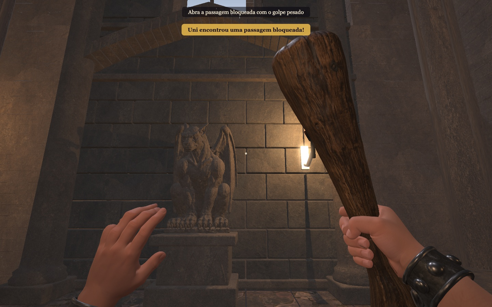
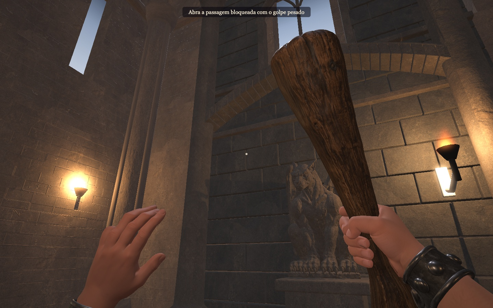
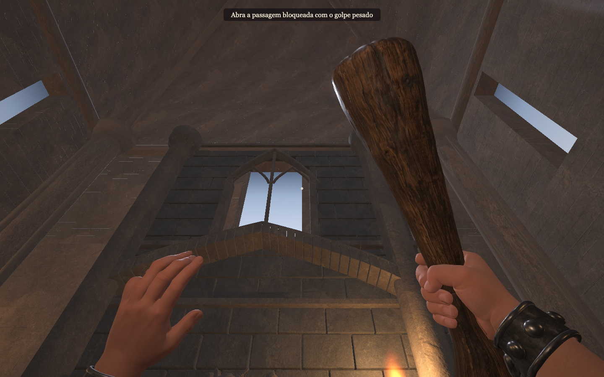

# Chapel bay study — issue 27

One south-wall bay, visually approved by the producer on 13 September 2026, before extending the finish across the room. This does not close issue 27.

- Meshy 7 gargoyle, finished in Blender with a 160,000-face reduction target. Task `01a09d63-894b-741b-ab1e-512787cc86d5`; API confirmed 20 credits.
- Individually beveled masonry, metric UVs, carved capitals, high pointed window and iron sconce support. Existing map and collision data are unchanged.
- Editable source: `assets/models/cenotaph/chapel-study.blend`. Rebuild with `pnpm blender scripts/build-chapel-study.py`; requires the ignored raw gargoyle export recorded in the ledger.
- Texture attribution and hashes: `assets/materials/chapel/sources.json` (Poly Haven, CC0).

## Evidence

Video: [In-game inspection](chapel-in-game.webm). Reproduce with `node scripts/measure-chapel.ts` against port 4190.

Validation: lint, TypeScript and 103 unit tests passed; 12 browser tests passed. Measurement: WebGPU, 1440×900, average 8.33 ms, p95 9.00 ms, worst 9.60 ms, 1,304 samples, no unhandled page errors. A Retina recording failed and is not evidence of supported performance at that resolution.

## Review boundaries

The approved stone now covers the portico, corridor and room architecture. Room columns run continuously from the floor to the nine-metre springing line, with one base and one capital; low corridor columns still end at their real four-metre ceiling. Floors and the remaining room dressing still need their own visual review before issue 27 can close.

## Architecture revision

Fixed Blender UV-layer loss during mesh joins. The regression test failed with only 3.45% mapped vertices in the stone material; it now requires more than 95% coverage on every textured primitive. All authoring pieces use one MetricUV layer before export.

Walls use joint-free rock textures over individually modeled blocks, avoiding painted mortar seams crossing real stone joints. Columns have recessed course joints and solid carved capital leaves. The pointed arch uses 32 separate voussoirs and raised borders. No additional Meshy credits were used.

The same local PBR source now supplies every wall, arch and column. Masonry receives restrained course relief; carved pieces use uninterrupted normal maps, preventing mortar lines from crossing shafts and capitals.
